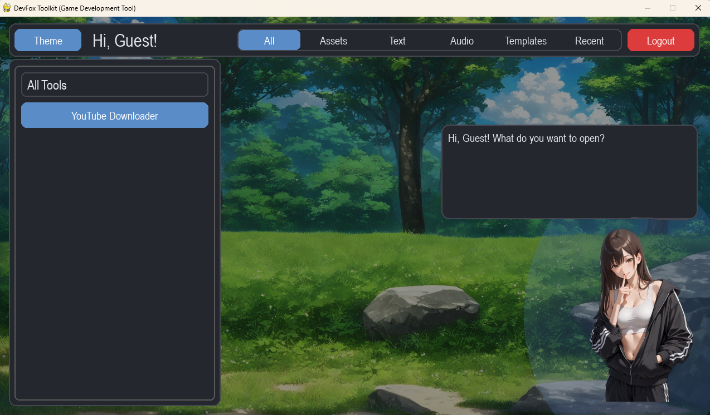

# LMS_Python

# 기능 추가
- 유튜브 음원 추출

## 프레임워크 폴더 구조.

main.py  # 실행 파일

- assets
   - 사용할 에셋 리스트

- core
   - app_state.py
   - fonts.py  # 폰트 관리
   - scene_manager.py # Scene 관리
   - theme.py # Dark 모드 / Light 모드 기타 모드 추가 가능

- scenes
   - login_scene.py  # 로그인 Scene
   - main_scene.py   # 메인 Scene
   - ytdownload_scene.py   # 유튜브 음원 추출 Scene

- ui
   - button.py          # 버튼
   - labelbox.py        # 기본 라벨 박스
   - listbox.py         # 리스트 아이템 박스
   - listcontainer.py   # 리스트 아이템 박스 관리 컨테이너
   - tabbar.py          # NavTab 아이템 박스 [listBox Vertical 버전]
   - textbox.py         # TextEdit 관리 박스

## 사용 모듈 리스트 [requestment.txt 목록]
- pip install pygame
- pip install yt-dlp pygame
- pip install yt-dlp pygame pyperclip
- winget install Gyan.FFmpeg

## 현재 버그 (TO DO LIST)
- 음원추출 아이템 동적 생성 [일체화 작업 미 진행]